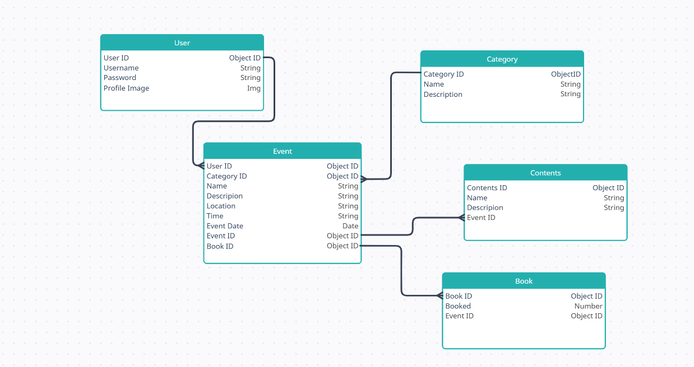

# Eventi
#  Overview
## Eventi is a comprehensive platform for creating, managing, and discovering events. Built with Django, this application allows users to organize events, manage attendees, and explore upcoming events. It is designed to be scalable and user-friendly, suitable for personal, corporate, or community use.


**Event Creation:**  Organizers can create events with details such as title, description, date, time, location, and ticketing options.

**Event Management:** 

* Edit or delete events.
* View attendee lists and statistics.                               

### **User Roles:**

* **Organizers:** Create and manage their events.

* **Attendees:** Register for events and manage bookings.

* **Search and Filters:** Easily find events by category, date, or location.

* **Notifications:** Email notifications for registrations, updates, and reminders.

* **Responsive Design:** Works seamlessly across devices.


## Installation

### Requirements

### **Server:**

**Python (v3.8 or later)**

**Django (v4.0 or later)**

**PostgreSQL (or any preferred database)**

##  Steps

**1. Clone the repository:**

  **git clone**
  [Repo Name](https://github.com/AK0275/Eventi)

**2. Navigate to the project directory:**
```
cd Eventi
```
**3. Install dependencies:**
```
pip install Django
```
**4. Create the project folders:**
```
django-admin startproject Eventi
```

**5. Create the app folders:**
```
python manage.py startapp
```

**6. Apply makemigrations:**
```
python manage.py makemigrations
```

**7. Apply migrations:**
```
python manage.py migrate
```
**8. Create a superuser:**
```
python manage.py createsuperuser
```
**9. Start the development server:**
```
python manage.py runserver
```
10. Access the application in your browser at http://127.0.0.1:8000.

## Usage
**1. Admin Setup:**

* Log in as an administrator to configure the website settings.

* Manage users and monitor event statistics.

**2. Organizers:**

* Create events with detailed descriptions and ticketing options.

* Manage attendees and view registrations.

**3. Attendees:**
* Browse events and register for the ones they are interested in.
* Manage their bookings and receive notifications.


# Wireframes

## Home Page


## About Page


## Add Events Page


## ERD

